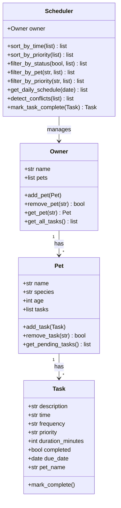

# PawPal+ (Module 2 Project)

**PawPal+** is a smart pet care management system built with Python and Streamlit. It helps pet owners track daily routines — feedings, walks, medications, and appointments — while using algorithmic logic to organize and prioritize tasks.

## Scenario

A busy pet owner needs help staying consistent with pet care. PawPal+ can:

- Track pet care tasks (walks, feeding, meds, enrichment, grooming, etc.)
- Consider constraints (time available, priority, owner preferences)
- Produce a daily plan sorted by time and priority
- Detect scheduling conflicts and warn the user
- Handle recurring tasks automatically

## System Architecture

The backend is built with four core Python classes using dataclasses:

| Class | Responsibility |
|-------|---------------|
| **Task** | Represents a single activity (description, time, frequency, priority, completion status) |
| **Pet** | Stores pet details and manages a list of tasks |
| **Owner** | Manages multiple pets and provides access to all their tasks |
| **Scheduler** | The "brain" — sorts, filters, detects conflicts, and handles recurring tasks |

### UML Diagram (Mermaid.js)



## Features

### Smarter Scheduling

- **Sort by time** — Tasks are displayed in chronological order using `HH:MM` string comparison.
- **Sort by priority** — High-priority tasks surface first (high → medium → low).
- **Filter by pet / status / priority** — Narrow down the schedule to what matters now.
- **Conflict detection** — If two tasks share the same time slot, PawPal+ displays a warning instead of crashing.
- **Recurring tasks** — When a "daily" or "weekly" task is marked complete, a new instance is automatically created for the next occurrence using `timedelta`.

## Getting Started

### Setup

```bash
python -m venv .venv
source .venv/bin/activate  # Windows: .venv\Scripts\activate
pip install -r requirements.txt
```

### Run the CLI demo

```bash
python main.py
```

### Run the Streamlit app

```bash
streamlit run app.py
```

## Testing PawPal+

Run the full test suite with:

```bash
python -m pytest
```

The test suite covers:

- **Task completion** — `mark_complete()` correctly changes status
- **Task addition** — Adding tasks increases the pet's task count
- **Sorting correctness** — Tasks are returned in chronological order
- **Recurrence logic** — Daily tasks create next-day instances; weekly tasks create next-week instances; one-time tasks do not recur
- **Conflict detection** — Duplicate time slots are flagged; different times produce no warnings; cross-pet conflicts are detected
- **Filtering** — Filter by pet name, completion status, and priority
- **Edge cases** — Empty schedules, pets with no tasks, non-existent pet lookups

**Confidence Level: ⭐⭐⭐⭐ (4/5)** — Core scheduling, sorting, filtering, and conflict detection are thoroughly tested. Future improvements would add duration-based overlap detection and integration tests for the Streamlit UI.
